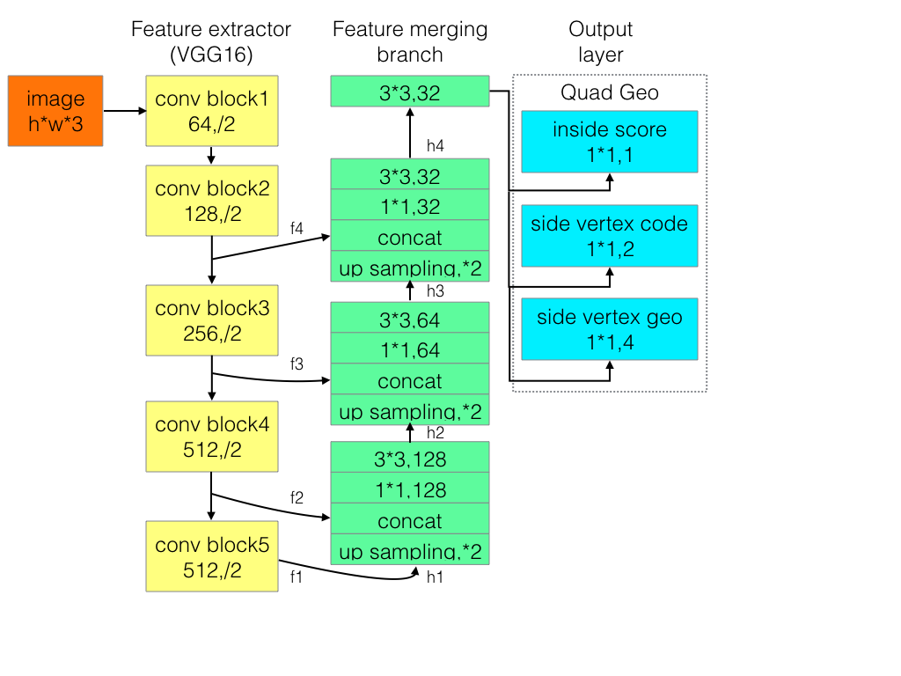

# ModifiedEAST
This repo was forked from https://github.com/huoyijie/AdvancedEAST and improved by chyelang for DL class at Tsinghua.

ModifiedEAST is an algorithm used for Scene image text detect,
which is primarily based on
[EAST:An Efficient and Accurate Scene Text Detector](https://arxiv.org/abs/1704.03155v2),
and the significant improvement was also made,
which make long text predictions more accurate.
If this project is helpful to you, welcome to star.

# advantages
* writen in keras, easy to read and run
* base on EAST, an advanced text detect algorithm
* easy to extend, various backbone to choose
* easy to train the model
* significant improvement was made, long text predictions more accurate.

# project files
* config file
    cfg_local.py and cfg_server.py, control parameters.
    you need to use --section server argument to use cfg_server.py, or cfg_local is used by default.
* pre-process data
    preprocess.py,resize image
* label data
    label.py,produce label info
* define network
    network.py
* define loss function
    losses.py
* execute training
    advanced_east.py and data_generator.py
* predict
    predict.py and nms.py
* auxiliary
    resnet.py: build and load pretrained weights for Resnet101, since it's not provided by Keras.
    tianchi_submit.py: generate coordinates of text block into .txt for test files.
    tianchi_check.py: draw text block on image for test images to verify the results.

# network arch
* East

* ModifiedEast

# setup
* python 3.5.0+
* tensorflow-gpu 1.4.0+ (or tensorflow 1.4.0+)
* keras 2.1.4+
* numpy 1.14.1+
* tqdm 4.19.7+
* h5py

# training
* prepare training data:make data root dir(icpr),
copy images to root dir, and copy txts to root dir,
data format details could refer to 'ICPR MTWI 2018 挑战赛二：网络图像的文本检测',
[Link](https://tianchi.aliyun.com/competition/introduction.htm?spm=5176.100066.0.0.3bcad780oQ9Ce4&raceId=231651)
* modify config params in cfg_local.py or config_server.py, depending on the machine you are running your codes, see default values.
you can specify --section local/server for the following commands, or the default --section local will be used.
if you want to specify a gpu to use, you need to modify Line 1 in cfg file.
* python preprocess.py, resize image size to a square whose width is in [257, 385, 513, 641, 737],
and train respectively could speed up training process.
* python label.py
* python advanced_east.py
* python predict.py to predict. You may need to specify a valid image path in main function of predict.py.
* python tianchi_submit.py to get submission file for test sets. First you need to copy icpr_mtwi_task2/image_test into cfg.data_dir.
* python tianchi_check.py to verify the prediction performance. You might need to read the code to prepare some data

# references
* [EAST:An Efficient and Accurate Scene Text Detector](https://arxiv.org/abs/1704.03155v2)
